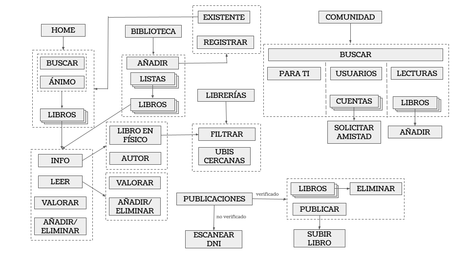
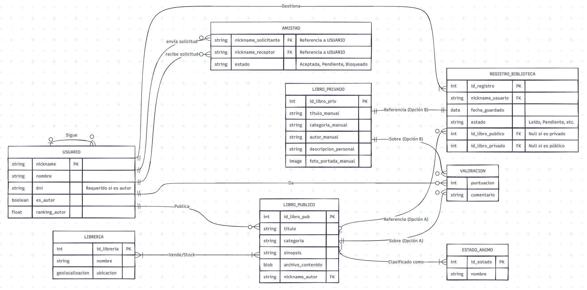

# Plan de entregas

A continuación una tabla resumen, pero se puede ver el plan de entregas en detalle [aquí](plan_entregas.pdf).

| Entrega | Objetivo | Iteraciones principales | Duración |
|--------:|----------|-------------------------|----------|
| 1 | Autenticación de usuarios (registro, login, logout) | Crear cuenta, iniciar/cerrar sesión, frontend login/registro | 1 semana |
| 2 | Subida y gestión de obras | Subir libros, lectura y reseñas, bibliotecas, frontend | 2 semanas |
| 3 | Gestión de perfil y bibliotecas | Perfil de usuario, edición de datos, estanterías, reseñas, frontend | 2 semanas |
| 4 | Visualización de librerías locales | Mostrar librerías cercanas, datos y enlaces, relación libros-librerías, frontend | 2 semanas |
| 5 | Búsqueda y recomendaciones sociales | Amigos, recomendaciones por popularidad y estado de ánimo, frontend | 3 semanas |
| 6 | Interacción social | Actividad de amigos, feed social, búsqueda global, frontend | 2 semanas |
| 7 | Pulido final | Mejora de frontend, corrección de errores, pruebas con usuarios | 2 semanas |

# Arquitectura de la información

Se puede ver el archivo [aquí](arquitectura_informacion/arquitectura_informacion.pdf).

## Información

Necesitamos guardar información sobre:
- Libros y su clasificación. 
- Escritores y lectores. 
- Librerías para encontrar libros en específico o ver qué tienen. 
- Registro y agrupación de libros (biblioteca personalizada). 
- Amistades entre usuarios.

## Organización de la información
### Esquema
- Libro: Exacto por título del libro. 
- Libro: Ambiguo por estado de ánimo asociado al libro o por autor. 
- Librería: Exacto por nombre o geolocalización. 
- Librería: Ambiguo por libro en venta o zona/cercanía. 
- Usuario: Exacto por nick.

### Estructura
Jerárquica - Basada en registros.

## Navegación
- Global: Librería → Libros. 
- Global: Autor → Libros. 
- Global: Estado de ánimo → Libros. 
- Local: Biblioteca → Libros agrupados en listas (por defecto, listas de estado: leídos, pendientes, etc.). 
- Contextual: Añadir libro actual a la biblioteca. 
- Contextual: Buscar librería donde encontrar el libro actual. 
- Local: Usuario → Libros que ha leído.

## Búsquedas
### Existencia 
- ¿En qué librería (y) encontrar un libro (x)? 
### Exploratoria 
- ¿Qué libros (x) vende una librería (y)? 
- ¿Qué libros (x) tiene un autor (z)? 
- ¿Qué libros (x) tienen un estado de ánimo (n)? 
- ¿Qué libros (x) he leído? 
- ¿Qué libros (x) ha leído el usuario (u)? 
### Elemento conocido 
- ¿De qué va un libro (x)? 
### Integral 
- Todos los libros de mi biblioteca. 
- Todos mis amigos. 

# Diagrama de tareas - HTA
Se puede ver el archivo [aquí](modelo_tareas/diagrama_hta.png).

  

# Diagrama de flujo - Wireflow
Se puede ver el archivo [aquí](diagrama_wireflow/wireflow.png).

  

# Diagrama conceptual
Se puede ver el archivo [aquí](diagrama_conceptual/diagrama_contenidos.png).

  

# Bocetos
Se pueden ver las imágenes [aquí](bocetos).
## Papel - Digital

  
  
  
  

 

  
  
  
  

 

  
  
  
  

 

  
  
  

 

  
  
  
  

 

  
  
  
  

 

  
  
  
  

 

  
  
  
  
  
  

## Mejoras aplicadas
Se puede ver el documento de la evaluación en detalle [aquí](../Practica4/DES_P4.pdf).
### Pre-evaluación
Realizamos algunos cambios en el prototipo antes de hacer la evaluación a los usuarios.
- Editamos los frames con formularios para que se puedan pulsar para simular rellenar los campos.
- Añadimos realimentación para indicar que se completen dichos campos si se pretende continuar sin hacerlo o que determinadas operaciones han sido realizadas (al subir libro o ficha).
- Editamos el frame del libro en detalle para incluir una opción para valorar, y añadimos un frame para poder simular la tarea.

  
  

 

  
  

 

  

    
  

  

### Post-evaluación
Durante las pruebas, se detectó que el significado de los iconos de estados de ánimo resultaba ambiguo para los participantes. Como solución, se ha incorporamos una etiqueta textual descriptiva debajo de cada componente gráfico. Esta medida reduce la carga cognitiva y garantiza que el usuario asocie correctamente el icono con la emoción deseada antes de realizar la selección.

 

Para solventar la confusión sobre la ubicación de las herramientas de filtrado tras el registro, se ha diseñó una pantalla de onboarding específica. Esta interfaz actúa como una guía contextual que indica al usuario, mediante una señalización visual clara, el punto exacto de la barra superior desde el cual puede modificar su estado de ánimo en cualquier momento de la navegación.

 

Dada la confusión recurrente entre la vista general (Home) y el catálogo personal del usuario, se reestructuró la sección de perfil mediante la inclusión del encabezado explícito “Mi biblioteca”. Este cambio refuerza el modelo mental del usuario, permitiéndole identificar de forma inmediata que se encuentra gestionando su propia colección de obras y favoritos.

 

## Mejoras diseñadas
Durante las pruebas, se detectó que algunos usuarios esperaban que la aplicación les cambiara de pantalla tras el mensaje de éxito. Se han hecho bocetos para determinar a qué pantallas llevaría cada actividad (cargar fichas y publicar libros respectivamente).

  
  

 

Se observó que los usuarios identificaban las estrellas que determinaban la puntuación media del libro con la puntuación que ellos otorgaban. Para no dar lugar a confusión, se ha rediseñado la sección del feedback de la pantalla de forma que se distinguen.

  
  

 

Para solventar el problema de localización del menú desplegable, se ha incorporado al diseño un icono (que podría ser la foto de perfil o una hamburguesa) de forma que si se pulsa también sale el desplegable.

  
  

 

# Enlace a los prototipos
[Papel](https://www.figma.com/design/GxaE7DWZ9VrI54CmcKra74/Flujo_Alejandria?node-id=115-2&t=65Z4kM3TxE8UKrFZ-1)

[Digital](https://www.figma.com/design/xHzQNbpoCi0e4Bx4CKGjU9/Flujo_Alejandria---Digital---Finalisimo?node-id=2002-2&t=3qvpMsHSSVF3WJXY-1)
